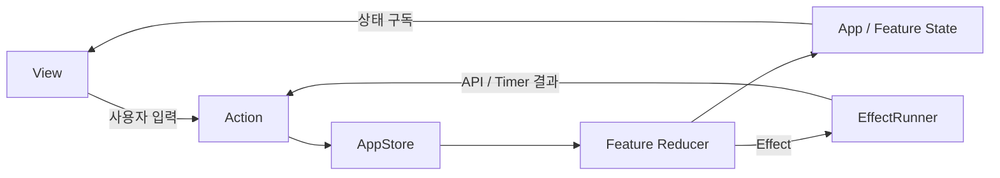
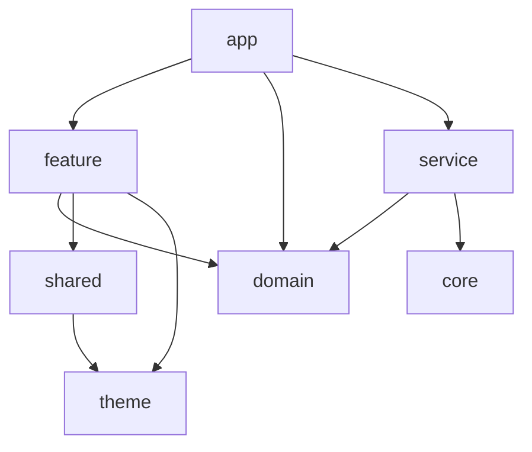

# Edencrew Flutter 과제

국내 주식 관심종목 화면을 구현한 Flutter 과제 1 프로젝트입니다.

## 실행 방법

- Flutter 3.47.3 stable / Dart 3.13.3
- 의존성 설치: `flutter pub get`
- 실행: `flutter run`
- 분석: `flutter analyze`
- 테스트: `flutter test`

제공된 Noto Sans KR과 Inter 폰트를 로컬 asset으로 등록했습니다. 네이티브 앱에서 동일한 글꼴을 사용하기 위해 기본 시스템 글꼴 대신 번들 폰트를 사용했습니다.

## 구현 범위

### 필수 구현

- 관심 화면: 종목명·종목코드·시장·현재가·등락 표시, 상승·하락·보합 색상, 새로고침, 탭 전환, 로딩 스켈레톤, 빈 상태, 3개 정렬 기준
- 검색 화면: 검색과 입력 지우기, 초기·결과 없음 상태, 검색어 하이라이트, 관심 등록·해제와 토스트, 상세 화면 이동
- 상세 화면: 종목 헤더와 관심 상태, 현재가와 등락, 4개 기간 탭, 캔들 차트, 요약 카드, 일별 시세 표
- 관심 상태 동기화: 관심·검색·상세 화면에서 하나의 관심 상태를 공유하고 변경 결과를 즉시 반영
- 데이터 연동: Naver 검색·메타데이터·시세·일봉 응답 요청 및 파싱

### 선택 및 추가 구현

- 검색 중 진행 표시와 결과 스켈레톤, 검색 결과 전환 애니메이션
- 검색 입력 debounce와 최근 검색어
- 관심 목록 Pull to refresh, 관심종목 삭제, 정렬 기준 저장
- 앱 재실행 후 관심 목록·정렬·최근 검색어 유지
- 기간 변경 중 기존 차트를 유지하는 차트 전환 애니메이션
- 차트 축 라벨, 거래량 바, 영역 채우기, 크로스헤어와 툴팁
- 일별 시세 무한 스크롤
- 일봉 페이지 캐시, 중복 요청 제거, 날짜 변경 시 캐시 무효화
- 네트워크 오류 재시도와 오래된 요청 결과 무시
- 토스트 자동 종료와 연속 표시 시 이전 타이머 취소
- 상태 전환·파싱·화면 레이아웃을 검증하는 Flutter 테스트 44개

### 별도 제출물

- 과제 2 Lucy Studio `targetAlert` 화면과 `cloneProject/assets` 압축 파일

## 기술 선택과 이유

상태 변경을 예측 가능하게 관리하기 위해 `Action → Reducer → State → View` 흐름을 사용했습니다. 관심·검색·상세 화면은 하나의 AppStore를 공유해 관심 상태가 화면마다 어긋나지 않도록 했습니다. 기능별 폴더와 App/Domain/Service/Core/Shared 경계를 사용해 네트워크·파싱·화면 책임을 분리했습니다.

차트는 외부 패키지보다 여백과 색상 토큰을 직접 제어하기 쉬운 `CustomPainter`로 구현했습니다. `get_it`은 앱 조립 시점의 의존성 주입에만 사용하고, View와 Reducer가 컨테이너를 직접 조회하지 않도록 했습니다.

## 직접 판단한 부분

- 시세를 아직 받지 못한 행은 정렬 시 목록 뒤에 배치했습니다.
- 토스트는 2초 동안 표시하고 새 토스트가 표시되면 이전 종료 타이머를 취소합니다.
- 네트워크 오류가 발생하면 기존 데이터는 유지하고 한국어 오류 문구와 재시도 동작을 제공합니다.

## 검증

Flutter 테스트 44개와 `flutter analyze`를 통과했고, `flutter build macos --debug`, `flutter build ios --simulator --debug`, `flutter build apk --debug`가 모두 성공했습니다. 393×852 기준 관심·검색·상세 및 빈 상태·정렬·토스트 렌더링을 확인했습니다. 실제 Naver 응답 샘플은 `assets/mock`에 보관했습니다.

## 디자인 토큰 사용 방식

색상·간격·반경·타이포그래피는 `lib/theme`에 있는 공통 토큰을 기준으로 사용했습니다. 화면에서는 색상 값을 직접 만들지 않고 `context.colors`와 `context.typography`를 통해 `surface`, `textPrimary`, `priceUpText`, `priceDownText`, `feedbackSkeleton` 같은 의미 기반 토큰을 참조합니다. 간격과 모서리 반경은 `AppDimens`로 통일했고, 공통 행·검색 필드·토스트·빈 상태·스켈레톤은 `lib/shared/design_system/stock_widgets.dart`에서 재사용합니다.

스켈레톤은 시세 요청 중인 종목 코드만 상태에 기록하고, 해당 행의 실제 값 영역을 `QuoteSkeleton`으로 대체합니다. 상세 화면도 같은 상태를 사용해 현재가 영역에 동일한 스켈레톤을 표시하므로 로딩 표현이 화면마다 달라지지 않습니다.

## 아키텍처

`View → Action → Reducer → State → View` 단방향 흐름을 사용합니다. `AppStore`가 관심·검색·상세 상태를 함께 보유하고, 각 기능의 Reducer는 자신의 상태 전환만 담당합니다. 네트워크 요청과 타이머는 `EffectRunner`가 실행합니다.



### 폴더와 의존성 흐름

```text
lib/
├── app/       # 앱 진입점, AppStore, 루트 Action·Reducer·State
├── feature/   # 관심·검색·상세 화면과 기능별 상태 전환
├── domain/    # 종목 모델, Repository 계약, UseCase
├── service/   # Naver API 요청과 응답 파싱
├── core/      # 네트워크, 시간, 공통 상태 기반
├── shared/    # 재사용 UI와 포맷팅
└── theme/     # 색상, 타이포그래피, 간격 토큰
```



`get_it`은 앱 조립 시점의 의존성 주입에만 사용합니다. View와 Reducer는 컨테이너를 직접 조회하지 않으며, 테스트에서는 Repository, 시간, 로컬 저장소를 가짜 구현으로 교체할 수 있습니다.
